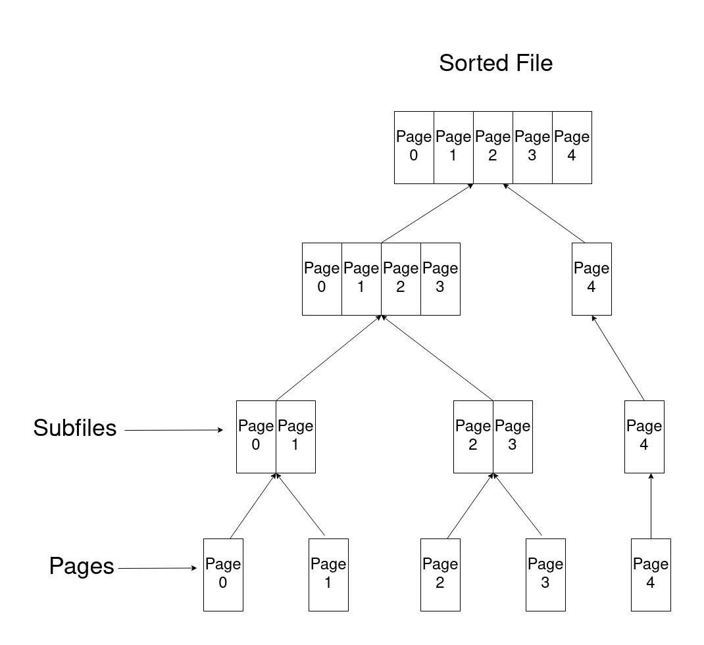
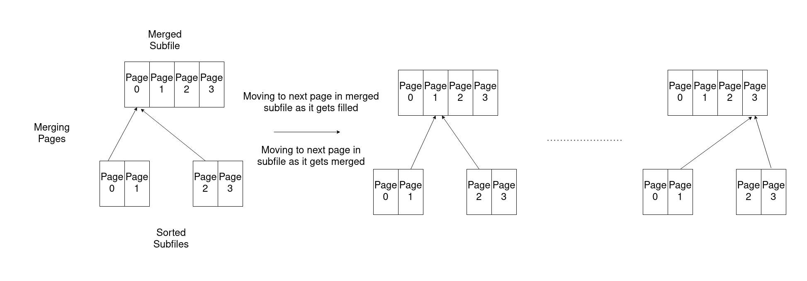
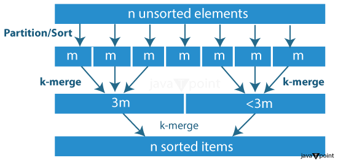
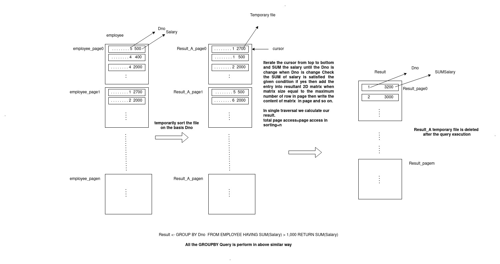
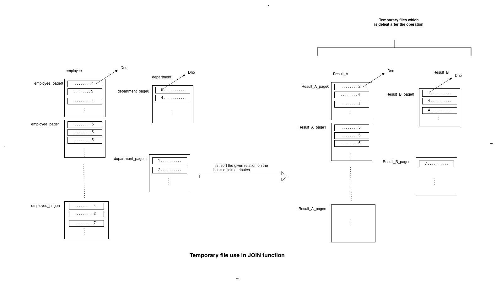
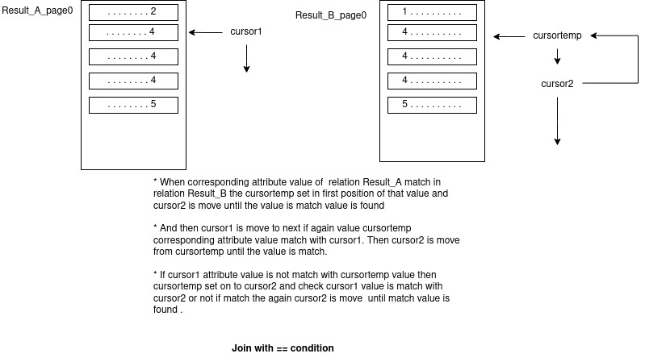

# Phase 2

# Task 1: Implementation of External Sorting

### Command:
``SORT <table_name> BY <column_name1, column_name2,..., column_namek> IN
<ASC|DESC, ASC|DESC,..., ASC|DESC>``

### Explanation:
1. The External Sorting has been implemented using the k-way sort-merge algorithm. The table is stored in pages in the database.
2. The First Phase of External Sorting involves the sorting of these individual pages of the table and storing them in temporary pages which are sorted.
3. The Next Phase includes merging these pages in a single file through multiple levels of merging.
We are using k-way merging of pages, i.e. merging k pages at a time. The key point to consider is though the pages are merged into a subfile logically, the subfile is still divided into multiple pages.
4. So, at each level we keep track of the pages in a subfile which are sorted and while merging k subfiles, we merge their pages one by one using Cursor and the page index of each subfile.
5. Once all the groups of k subfiles are merged at a particular level we move on to the next level, where number of subfiles are reduced by a factor of k while the pages of a subfile are increased by a factor of k but the total pages remain the same.
6. Repeating the merging at each level we finally get a single subfile which has the total table sorted in it's pages.
7. Now, for the Sort Command, these temp pages which are now sorted are written over the pages of the original table and these temp pages are then deleted. At each level, the temp pages of previous levels are also deleted.
8. For sorting the table based on multiple columns, we have made a comparator function which takes 2 rows and compares them in order of the priority of columns to be sorted on.

k=2 Sort Merge

# Task 2: Applications of External Sorting

## Part A: ORDER BY

### Command:
``<new_table> <- ORDER BY <attribute> ASC|DESC ON <table_name>``

### Explanation:
1. The ORDER BY query internally uses the same functionality of the SORT query so the explaination is same as for SORT.
2. The only difference is when the table is completely sorted in the temporary files, a new table is created given by the <new_table> and the sorted pages are copied into the pages of this new table.

## PART-B: GROUP BY

### Command:
``<new_table> <- GROUP BY <grouping_attribute> FROM <table_name> HAVING <aggregate(attribute)> <bin_op><attribute_value> RETURN <aggregate_func(attribute)>``  
### Explanation:  
1. First sorting of table is done on the basis grouping attribute.
2. Then traverse that table to search for group of rows that are satisfying condition mentioned in having clause.
3. Then apply the aggregate function on all rows of group that are satisfying that condition and store the result in resultant table with grouping attribute.
4. Number of block access = Number of Blocks required in sorting + n(for linear traversing of table)

   
   

## PART-C: JOIN
### Command:
``<new_relation_name> <- JOIN <tablename1>, <tablename2> ON <column1> <bin_op> <column2>``
### Explanation:

#### Common function for all 6 operators:
   1. As it is mentioned in an assignment that we have to use External sort for implementation of all tasks so for joining two tables first we have to sort them using external_sort function and store the result in two temp files with name Table1_temp and Table2_temp. Then we are using these sorted temporary tables for implementing join on the basis of the given operator.
   2. We are also passing a parsed query object which contains all necessary information required for join implementation.

<ins> **joinWithEqual** </ins>   

**step 1** In this function we have used two cursor cursor1 and cursor2  for traversing both tables and one temporary cursor to point to the location of the first matched field so that we will not traverse from the beginning of the second table for next value of the first table.

**step 2** First of all two cursors are initialized on the very first row of both tables then we read these two tables row by row untill the values in the join attribute are equal in both rows.

**step 3** If the value in the join column in table1 is lesser than the value in table2 then we will move the value of cursor1 by one row down.

**step 4** If the value in the join column in table2 are lesser than the value in table1 then we will move the value of cursor2 by one row down.

**step 5** After reaching this row where the value of the join column in both tables are equal we will set a temporary cursor on the second table and set the page index of that cursor equal to the page index of table 2 for which cursor2 is currently pointing and then set the row  pointer of that cursor equal to the row index of cursor2.  

**step 6** Then we will traverse cursor2 till we are getting equal values in the joined column in both tables. we will merge these two selected rows to make a single row which we are storing in a temporary 2-D vector as a result of joining.  

**step 7** After this, we will move cursor1 by one row and check if the value in the join column in this row is equal to the previously matched value in Table1  
if yes-> then we put cursor2 at a location that is pointing by cursortemp and repeat steps 4 and 5.
if not -> then we will again start with step3 and step4 and repeat the whole process accordingly.      

# Assumptions
1. k pages are merged at a time, so the buffer blocks at any time in the main memory are at most k+1 - k for reading pages of the k subfiles to be merged and 1 for writing to the page of the merged subfile.
2. While merging at each level same number of temporary pages are created as in the original table and are deleted in the next level.
3. If there is no row in resultant table after performing the given operation then our resultant table will contain a single row having -1 as a value in each attribute.
5. Our resultant table is sorted according to the join column of first table.    

# Learnings
1. Learned to implement External Sort on tables based on ordering priority of multiple columns and to handle the merging of the pages of subfiles into multiple pages of merged subfile.
2. Learned to implement join on the basis of diffrent conditional operator. where each implementation is applied on sorted table to get the result in optimal way.
3. Learned to implement group by on the basis of diffrent aggrigate function. where each implementation is applied on sorted table to get the result in optimal way.
4. Learned how to deal with large files(tables) which is stored in multiple pages. How we can traverse these file using cursor.

# Contribution
## Queries implemented by each member

1. Bipasha: Inplace Sort, Order By
2. Tanish: Group by, Hash Join
3. Shivam: Documentation
